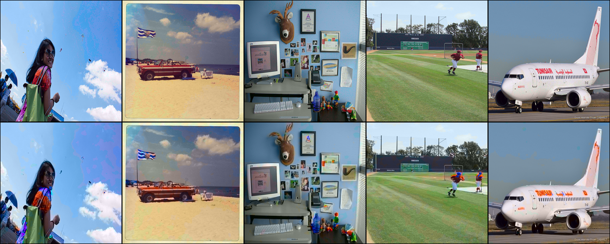
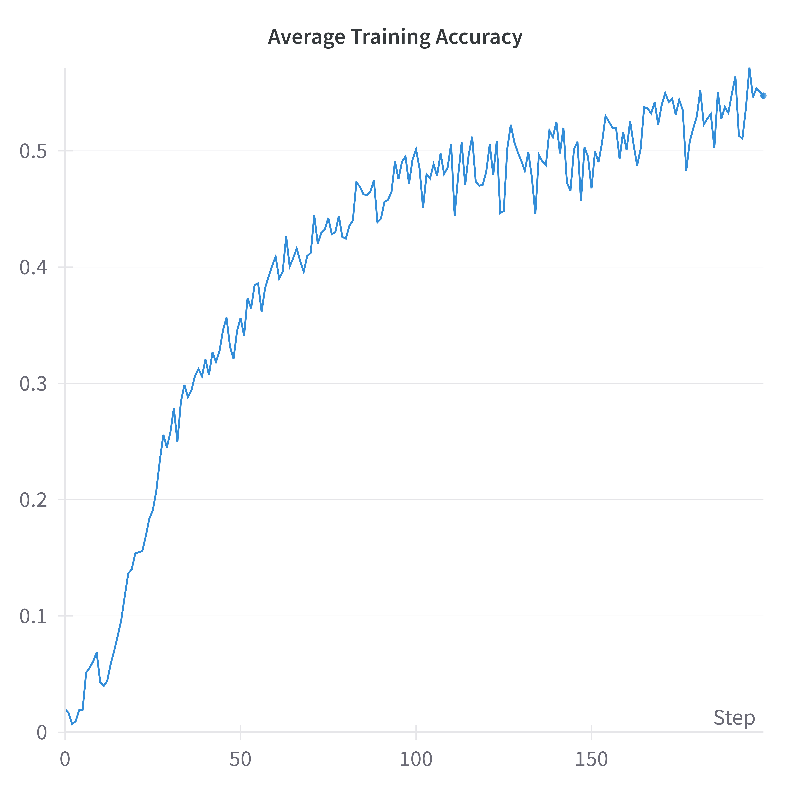
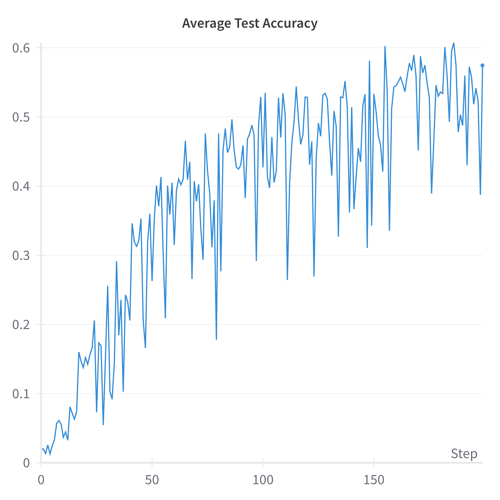
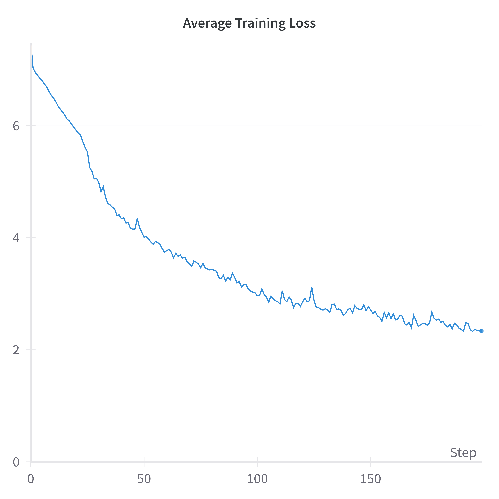
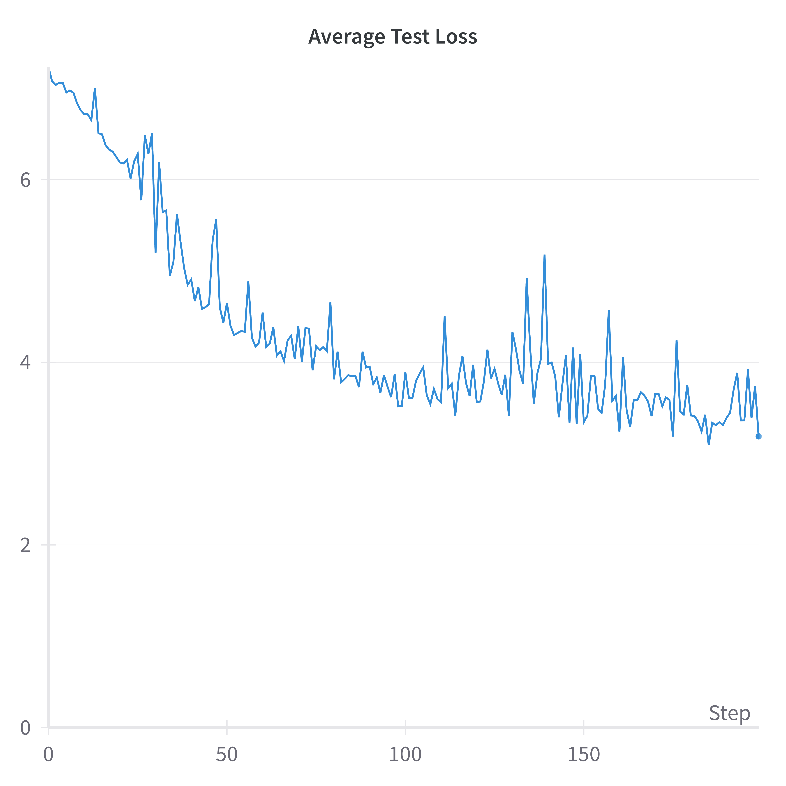

# User Guided Image Colorization

This project introduces an approach to user-guided grayscale image colorization utilizing a UNet architecture combined with a custom class rebalancing and classification cross-entropy loss framework.

## Setup

1. Clone this repository:

   ```bash
   git clone https://github.com/kushaangowda/User_Guided_Image_Colorization.git
   ```

2. Install the dependencies:

   ```bash
   pip install -r requirements.txt
   ```

3. Create the dataset:

   1. Download any image dataset, such as [MSCOCO](https://cocodataset.org/#download), into the `data` folder.
   2. Run the following command:

      ```bash
      cd utils
      python dataset_creation.py
      ```

      This command generates `image_data.h5`.

## Model Training

Execute the training script with the following command:

```bash
torchrun --nproc_per_node=1 main.py --batch_size=16 --epochs=20 --data_path="image_data.h5" --mode="train" --type=1
```

### Parameters

- `batch_size`: Batch size for training.
- `epochs`: Number of training epochs.
- `data_path`: Path to the file containing image features.
- `lr`: Learning rate for the optimizer.
- `wd`: Weight decay parameter for the optimizer.
- `type`: Model type, where 0 = Simple UNet, 1 = ResUNet, 2 = TransUNet.
- `path`: Path to the pretrained model weights (if applicable).
- `rank`, `local_rank`, `world_size`, `workers`: Parameters for the distributed training setup.

## Model Inference

For model inference, use the following command:

```bash
torchrun --nproc_per_node=1 main.py --batch_size=1 --data_path="image_data_1k.h5" --mode="predict" --type=1 --path=""
```

### Parameters

- `batch_size`: Batch size for testing.
- `data_path`: Path to the file containing image features.
- `type`: Model type.
- `path`: Path to the pretrained model weights (if applicable).

## Example Predictions

Ground Truth (Top), Predictions (Bottom):



## Evaluation Curves

Training and Testing Accuracy and Loss Graphs:

<div style="display:flex">


</div>
<div style="display:flex">


</div>

## Model Architecture


We have enhanced the U-Net architecture by integrating ResNet blocks within both the encoder and decoder pathways to improve feature extraction capabilities and support gradient flow during training. The encoder features a ResNet block followed by max pooling, while the decoder incorporates a ResNet block and an upsampling operation. This design leverages deep residual learning to facilitate training deeper networks by alleviating the vanishing gradient problem, thereby enhancing its effectiveness for accurate image colorization.

## Team Members

- [Kushaan Gowda](https://github.com/kushaangowda)
- [Sujeeth Bhavanam](https://github.com/Sujeeth13)
